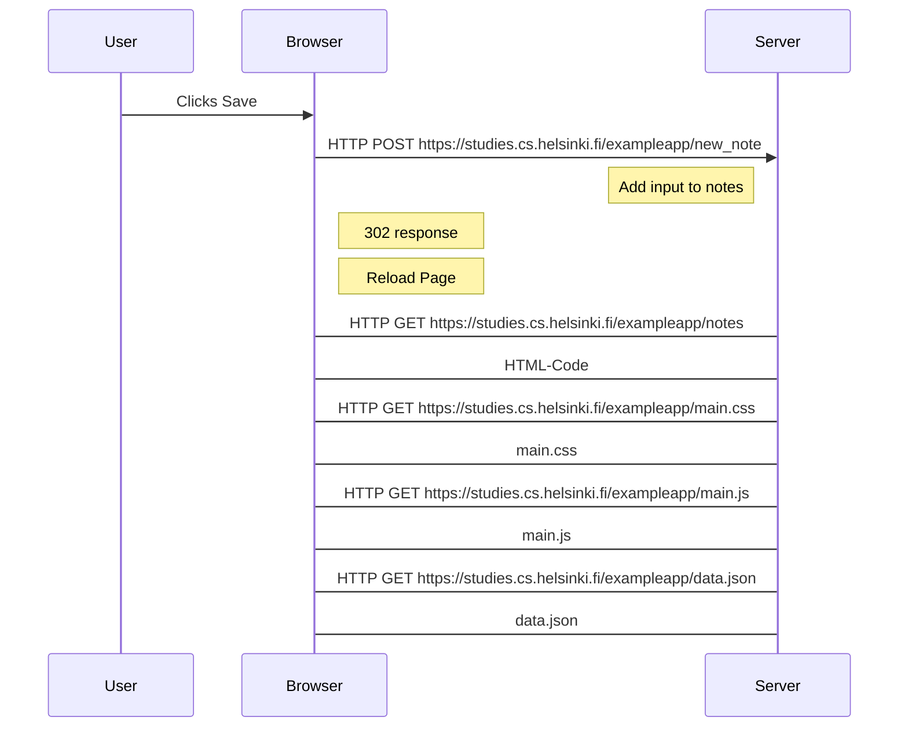

```mermaid
sequenceDiagram

User->>Browser: Clicks Save
Browser->>Server: HTTP POST https://studies.cs.helsinki.fi/exampleapp/new_note
note left of Server: Add input to notes
note right of Browser: 302 response
note right of Browser: Reload Page
Browser->Server: HTTP GET https://studies.cs.helsinki.fi/exampleapp/notes
Server->Browser: HTML-Code
Browser->Server: HTTP GET https://studies.cs.helsinki.fi/exampleapp/main.css
Server->Browser: main.css
Browser->Server: HTTP GET https://studies.cs.helsinki.fi/exampleapp/main.js
Server->Browser: main.js
Browser->Server: HTTP GET https://studies.cs.helsinki.fi/exampleapp/data.json
Server->Browser: data.json

```
